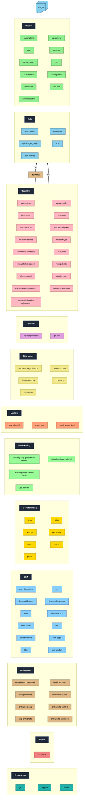

```mermaid

flowchart TB

Images@{ shape: docs, label: "Images"}

subgraph DatasetGroup[" "]
    direction RL
    Dataset["Dataset"]
    ds_bg["bg-removal"]
    ds_camera_lens["camera-lens"]
    ds_cameras["cameras"]
    ds_gcp["gcp"]
    ds_geo["geo"]
    ds_gps_accuracy["gps-accuracy"]
    ds_primary_band["primary-band"]
    ds_sky_removal["sky-removal"]
    ds_use_exif["use-exif"]
    ds_video_limit["video-limit"]
    ds_video_resolution["video-resolution"]

    ds_bg ~~~ ds_camera_lens
    ds_cameras ~~~ ds_gcp
    ds_geo ~~~ ds_gps_accuracy
    ds_primary_band ~~~ ds_sky_removal
    ds_use_exif ~~~ ds_video_limit
    ds_video_resolution

    click ds_bg "../options-flags/#bg-removal"
    click ds_camera_lens "../options-flags/#camera-lens"
    click ds_cameras "../options-flags/#cameras"
    click ds_gcp "../options-flags/#gcp"
    click ds_geo "../options-flags/#geo"
    click ds_gps_accuracy "../options-flags/#gps-accuracy"
    click ds_primary_band "../options-flags/#primary-band"
    click ds_sky_removal "../options-flags/#sky-removal"
    click ds_use_exif "../options-flags/#use-exif"
    click ds_video_limit "../options-flags/#video-limit"
    click ds_video_resolution "../options-flags/#video-resolution"
end


subgraph SplitGroup[" "]
    direction RL
    Split["Split"]
    split_sm_cluster["sm-cluster"]
    split_sm_no_align["sm-no-align"]
    split_split["split"]
    split_image_groups["split-image-groups"]
    split_overlap["split-overlap"]
    Split
    split_sm_cluster ~~~ split_sm_no_align
    split_split ~~~ split_image_groups
    split_overlap

    click split_sm_cluster "../options-flags/#sm-cluster"
    click split_sm_no_align "../options-flags/#sm-no-align"
    click split_split "../options-flags/#split"
    click split_image_groups "../options-flags/#split-image-groups"
    click split_overlap "../options-flags/#split-overlap"
end

    Spliting["`**Splitting**`"]


subgraph OpenSFMGroup[" "]
    direction RL
    OpenSFM["OpenSFM"]
    sfm_feature_quality["feature-quality"]
    sfm_feature_type["feature-type"]
    sfm_force_gps["force-gps"]
    sfm_ignore_gsd["ignore-gsd"]
    sfm_matcher_neighbors["matcher-neighbors"]
    sfm_matcher_order["matcher-order"]
    sfm_matcher_type["matcher-type"]
    sfm_min_num_features["min-num-features"]
    sfm_pc_quality["pc-quality"]
    sfm_radiometric_calibration["radiometric-calibration"]
    sfm_rolling_shutter["rolling-shutter"]
    sfm_rolling_shutter_readout["rolling-shutter-readout"]
    sfm_algorithm["sfm-algorithm"]
    sfm_no_partial["sfm-no-partial"]
    sfm_skip_band_alignment["skip-band-alignment"]
    sfm_use_fixed_camera_params["use-fixed-camera-params"]
    sfm_use_hybrid_bundle_adjustment["use-hybrid-bundle-adjustment"]

    OpenSFM
    sfm_feature_quality ~~~ sfm_feature_type
    sfm_force_gps ~~~ sfm_ignore_gsd
    sfm_matcher_neighbors ~~~ sfm_matcher_order
    sfm_matcher_type ~~~ sfm_min_num_features
    sfm_pc_quality ~~~ sfm_radiometric_calibration
    sfm_rolling_shutter ~~~ sfm_rolling_shutter_readout
    sfm_algorithm ~~~ sfm_no_partial
    sfm_skip_band_alignment ~~~ sfm_use_fixed_camera_params
    sfm_use_hybrid_bundle_adjustment

    click sfm_feature_quality "../options-flags/#feature-quality"
    click sfm_feature_type "../options-flags/#feature-type"
    click sfm_force_gps "../options-flags/#force-gps"
    click sfm_ignore_gsd "../options-flags/#ignore-gsd"
    click sfm_matcher_neighbors "../options-flags/#matcher-neighbors"
    click sfm_matcher_order "../options-flags/#matcher-order"
    click sfm_matcher_type "../options-flags/#matcher-type"
    click sfm_min_num_features "../options-flags/#min-num-features"
    click sfm_pc_quality "../options-flags/#pc-quality"
    click sfm_radiometric_calibration "../options-flags/#radiometric-calibration"
    click sfm_rolling_shutter "../options-flags/#rolling-shutter"
    click sfm_rolling_shutter_readout "../options-flags/#rolling-shutter-readout"
    click sfm_algorithm "../options-flags/#sfm-algorithm"
    click sfm_no_partial "../options-flags/#sfm-no-partial"
    click sfm_skip_band_alignment "../options-flags/#skip-band-alignment"
    click sfm_use_fixed_camera_params "../options-flags/#use-fixed-camera-params"
    click sfm_use_hybrid_bundle_adjustment "../options-flags/#use-hybrid-bundle-adjustment"
end

subgraph OpenMVSGroup[" "]
    direction RL
    OpenMVS["OpenMVS"]
    openmvs_pc_filter["pc-filter"]
    openmvs_pc_skip_geometric["pc-skip-geometric"]

    OpenMVS
    openmvs_pc_filter ~~~ openmvs_pc_skip_geometric

    click openmvs_pc_filter "../options-flags/#pc-filter"
    click openmvs_pc_skip_geometric "../options-flags/#pc-skip-geometric"
end

subgraph FilterpointsGroup[" "]
    direction RL
    Filterpoints["Filterpoints"]
    filter_auto_boundary["auto-boundary"]
    filter_auto_boundary_distance["auto-boundary-distance"]
    filter_boundary["boundary"]
    filter_fast_orthophoto["fast-orthophoto"]
    filter_pc_sample["pc-sample"]

    Filterpoints
    filter_auto_boundary ~~~ filter_auto_boundary_distance
    filter_boundary ~~~ filter_fast_orthophoto
    filter_pc_sample

    click filter_auto_boundary "../options-flags/#auto-boundary"
    click filter_auto_boundary_distance "../options-flags/#auto-boundary-distance"
    click filter_boundary "../options-flags/#boundary"
    click filter_fast_orthophoto "../options-flags/#fast-orthophoto"
    click filter_pc_sample "../options-flags/#pc-sample"
end

subgraph MeshingGroup[" "]
    direction RL
    Meshing["Meshing"]
    mesh_octree_depth["mesh-octree-depth"]
    mesh_size["mesh-size"]
    mesh_skip_3dmodel["skip-3dmodel"]
    Meshing
    mesh_octree_depth ~~~ mesh_size ~~~ mesh_skip_3dmodel

    click mesh_octree_depth "../options-flags/#mesh-octree-depth"
    click mesh_size "../options-flags/#mesh-size"
    click mesh_skip_3dmodel "../options-flags/#skip-3dmodel"
end

subgraph MvsTexturingGroup[" "]
    direction RL

    MvsTexturing["MvsTexturing"]
    texturing_keep_unseen_faces["texturing-keep-unseen-faces"]
    texturing_single_material["texturing-single-material"]
    texturing_skip_global_seam_leveling["texturing-skip-global-seam-leveling"]
    texturing_use_3dmesh["use-3dmesh"]
    MvsTexturing

    texturing_keep_unseen_faces
    texturing_single_material ~~~ texturing_skip_global_seam_leveling
    texturing_use_3dmesh

    click texturing_keep_unseen_faces "../options-flags/#texturing-keep-unseen-faces"
    click texturing_single_material "../options-flags/#texturing-single-material"
    click texturing_skip_global_seam_leveling "../options-flags/#texturing-skip-global-seam-leveling"
    click texturing_use_3dmesh "../options-flags/#use-3dmesh"
end

subgraph GeoreferencingGroup[" "]
    direction RL
    Georeferencing["Georeferencing"]
    georef_align["align"]
    georef_crop["crop"]
    georef_pc_classify["pc-classify"]
    georef_pc_copc["pc-copc"]
    georef_pc_csv["pc-csv"]
    georef_pc_ept["pc-ept"]
    georef_pc_las["pc-las"]
    Georeferencing
    georef_align ~~~ georef_crop
    georef_pc_classify ~~~ georef_pc_copc
    georef_pc_csv ~~~ georef_pc_ept
     georef_pc_las

    click georef_align "../options-flags/#align"
    click georef_crop "../options-flags/#crop"
    click georef_pc_classify "../options-flags/#pc-classify"
    click georef_pc_copc "../options-flags/#pc-copc"
    click georef_pc_csv "../options-flags/#pc-csv"
    click georef_pc_ept "../options-flags/#pc-ept"
    click georef_pc_las "../options-flags/#pc-las"
end

subgraph DEMGroup[" "]
    direction RL
    DEM["DEM"]
    dem_cog["cog"]
    dem_decimation["dem-decimation"]
    dem_euclidean_map["dem-euclidean-map"]
    dem_gapfill_steps["dem-gapfill-steps"]
    dem_resolution["dem-resolution"]
    dem_dsm["dsm"]
    dem_dtm["dtm"]
    dem_smrf_scalar["smrf-scalar"]
    dem_smrf_slope["smrf-slope"]
    dem_smrf_threshold["smrf-threshold"]
    dem_smrf_window["smrf-window"]
    dem_tiles["tiles"]
    DEM

    dem_cog ~~~ dem_decimation
    dem_euclidean_map ~~~ dem_gapfill_steps
    dem_resolution ~~~ dem_dsm
    dem_dtm ~~~ dem_smrf_scalar
    dem_smrf_slope ~~~ dem_smrf_threshold
    dem_smrf_window ~~~ dem_tiles

    click dem_cog "../options-flags/#cog"
    click dem_decimation "../options-flags/#dem-decimation"
    click dem_euclidean_map "../options-flags/#dem-euclidean-map"
    click dem_gapfill_steps "../options-flags/#dem-gapfill-steps"
    click dem_resolution "../options-flags/#dem-resolution"
    click dem_dsm "../options-flags/#dsm"
    click dem_dtm "../options-flags/#dtm"
    click dem_smrf_scalar "../options-flags/#smrf-scalar"
    click dem_smrf_slope "../options-flags/#smrf-slope"
    click dem_smrf_threshold "../options-flags/#smrf-threshold"
    click dem_smrf_window "../options-flags/#smrf-window"
    click dem_tiles "../options-flags/#tiles"
end

subgraph OrthophotoGroup[" "]
    direction RL
    Orthophoto["Orthophoto"]
    ortho_build_overviews["build-overviews"]
    ortho_compression["orthophoto-compression"]
    ortho_cutline["orthophoto-cutline"]
    ortho_kmz["orthophoto-kmz"]
    ortho_no_tiled["orthophoto-no-tiled"]
    ortho_png["orthophoto-png"]
    ortho_resolution["orthophoto-resolution"]
    ortho_skip["skip-orthophoto"]
    Orthophoto
    ortho_build_overviews ~~~ ortho_compression
    ortho_cutline ~~~ ortho_kmz
    ortho_no_tiled ~~~ ortho_png
    ortho_resolution ~~~ ortho_skip

    click ortho_build_overviews "../options-flags/#build-overviews"
    click ortho_compression "../options-flags/#orthophoto-compression"
    click ortho_cutline "../options-flags/#orthophoto-cutline"
    click ortho_kmz "../options-flags/#orthophoto-kmz"
    click ortho_no_tiled "../options-flags/#orthophoto-no-tiled"
    click ortho_png "../options-flags/#orthophoto-png"
    click ortho_resolution "../options-flags/#orthophoto-resolution"
    click ortho_skip "../options-flags/#skip-orthophoto"
end

subgraph ReportGroup[" "]
    direction TB
    Report["Report"]
    report_skip["skip-report"]
    Report ~~~ report_skip
    report_skip

    click report_skip "../options-flags/#skip-report"
end

subgraph PostprocessGroup[" "]
    direction RL
    Postprocess["Postprocess"]
    post_3d_tiles["3d-tiles"]
    post_copy_to["copy-to"]
    post_gltf["gltf"]
    Postprocess
    post_3d_tiles ~~~ post_copy_to ~~~ post_gltf

    click post_3d_tiles "../options-flags/#3d-tiles"
    click post_copy_to "../options-flags/#copy-to"
    click post_gltf "../options-flags/#gltf"
end

Images e01@==> DatasetGroup
DatasetGroup e02@--> SplitGroup

SplitGroup == Yes ==> Spliting ==> OpenSFMGroup
SplitGroup == No ==> OpenSFMGroup

OpenSFMGroup e02@--> OpenMVSGroup
OpenMVSGroup e03@--> FilterpointsGroup
FilterpointsGroup e04@--> MeshingGroup
MeshingGroup e05@--> MvsTexturingGroup
MvsTexturingGroup e06@--> GeoreferencingGroup
GeoreferencingGroup e07@--> DEMGroup
DEMGroup e08@--> OrthophotoGroup
OrthophotoGroup e09@--> ReportGroup
ReportGroup e10@--> PostprocessGroup


classDef subgraphTitle fill:#1f2937,stroke:#94a3b8,stroke-width:1.5px,color:#fff,font-weight:bold;
classDef greenNode fill:#90EE90,stroke:#2d5016,stroke-width:1px,color:#000;
classDef blueNode fill:#87CEEB,stroke:#1e3a5f,stroke-width:1px,color:#000;
classDef pinkNode fill:#FFB6C1,stroke:#8b3a3a,stroke-width:1px,color:#000;
classDef purpleNode fill:#DDA0DD,stroke:#5d3a5d,stroke-width:1px,color:#000;
classDef yellowNode fill:#F0E68C,stroke:#8b8b00,stroke-width:1px,color:#000;
classDef orangeNode fill:#FFA07A,stroke:#8b4513,stroke-width:1px,color:#000;
classDef mintNode fill:#98FB98,stroke:#3a5f3a,stroke-width:1px,color:#000;
classDef goldNode fill:#FFD700,stroke:#8b7500,stroke-width:1px,color:#000;
classDef skyNode fill:#87CEFA,stroke:#1e3a8a,stroke-width:1px,color:#000;
classDef sandNode fill:#DEB887,stroke:#5d4e37,stroke-width:1px,color:#000;
classDef redNode fill:#F08080,stroke:#8b3a3a,stroke-width:1px,color:#000;
classDef tealNode fill:#20B2AA,stroke:#0d5d5d,stroke-width:1px,color:#000;
classDef animatedEdge stroke-dasharray: 9,5,stroke-dashoffset: 900,animation: dash 25s linear infinite;

class e01,e02,e03,e04,e05,e06,e07,e08,e09,e10 animatedEdge;


class Dataset,Split,OpenSFM,OpenMVS,Filterpoints,Meshing,MvsTexturing,Georeferencing,DEM,Orthophoto,Report,Postprocess subgraphTitle;
class ds_bg,ds_camera_lens,ds_cameras,ds_gcp,ds_geo,ds_gps_accuracy,ds_primary_band,ds_sky_removal,ds_use_exif,ds_video_limit,ds_video_resolution greenNode;
class Images,split_sm_cluster,split_sm_no_align,split_split,split_image_groups,split_overlap blueNode;
class sfm_feature_quality,sfm_feature_type,sfm_force_gps,sfm_ignore_gsd,sfm_matcher_neighbors,sfm_matcher_order,sfm_matcher_type,sfm_min_num_features,sfm_pc_quality,sfm_radiometric_calibration,sfm_rolling_shutter,sfm_rolling_shutter_readout,sfm_algorithm,sfm_no_partial,sfm_skip_band_alignment,sfm_use_fixed_camera_params,sfm_use_hybrid_bundle_adjustment pinkNode;
class openmvs_pc_filter,openmvs_pc_skip_geometric purpleNode;
class filter_auto_boundary,filter_auto_boundary_distance,filter_boundary,filter_fast_orthophoto,filter_pc_sample yellowNode;
class mesh_octree_depth,mesh_size,mesh_skip_3dmodel orangeNode;
class texturing_keep_unseen_faces,texturing_single_material,texturing_skip_global_seam_leveling,texturing_use_3dmesh mintNode;
class georef_align,georef_crop,georef_pc_classify,georef_pc_copc,georef_pc_csv,georef_pc_ept,georef_pc_las goldNode;
class dem_cog,dem_decimation,dem_euclidean_map,dem_gapfill_steps,dem_resolution,dem_dsm,dem_dtm,dem_smrf_scalar,dem_smrf_slope,dem_smrf_threshold,dem_smrf_window,dem_tiles skyNode;
class Spliting,ortho_build_overviews,ortho_compression,ortho_cutline,ortho_kmz,ortho_no_tiled,ortho_png,ortho_resolution,ortho_skip sandNode;
class report_skip redNode;
class post_3d_tiles,post_copy_to,post_gltf tealNode;

```